# GitOps-Driven Infrastructure Automation with Real-Time Monitoring and Alerting

A production-grade GitOps pipeline built with ArgoCD, Kubernetes, Prometheus, Grafana, Alertmanager, and Terraform. This project demonstrates automated infrastructure synchronization from Git, real-time observability, and intelligent alerting with live failure simulation and detection.

---

## Architecture Overview

```
Developer pushes to GitHub
        │
        ▼
   ArgoCD detects drift
        │
        ▼
Kubernetes auto-syncs
        │
        ▼
Prometheus scrapes metrics
        │
        ▼
Grafana visualizes dashboards
        │
        ▼
Alertmanager fires alerts on anomalies
```

---

## Tech Stack

| Layer | Tool |
|---|---|
| Containerization | Docker |
| Orchestration | Kubernetes (Minikube) |
| GitOps Engine | ArgoCD |
| Infrastructure as Code | Terraform |
| Monitoring | Prometheus + Grafana |
| Alerting | Alertmanager |
| Application | Python Flask |
| Version Control | Git + GitHub |

---

## Project Structure

```
gitops-monitoring-project/
├── app/
│   ├── app.py                   # Flask app with Prometheus metrics endpoints
│   ├── Dockerfile               # Container image definition
│   └── requirements.txt         # Python dependencies
├── k8s/
│   ├── deployment.yaml          # Kubernetes deployment with health checks
│   ├── service.yaml             # NodePort service exposing the app
│   └── namespace.yaml           # Namespace definition
├── monitoring/
│   └── prometheus-values.yaml   # Helm values for kube-prometheus-stack
├── alerting/
│   └── alertmanager-config.yaml # Custom PrometheusRule definitions
├── terraform/
│   └── main.tf                  # IaC for namespaces and config maps
├── argocd/
│   └── application.yaml         # ArgoCD Application manifest
├── screenshots/                 # Demo and verification screenshots
└── README.md
```

---

## Screenshots

### ArgoCD UI — Application Synced and Healthy
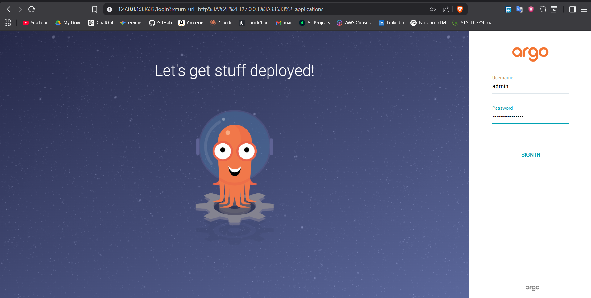

### ArgoCD — Pod Health Status


### Grafana UI — Dashboard Overview
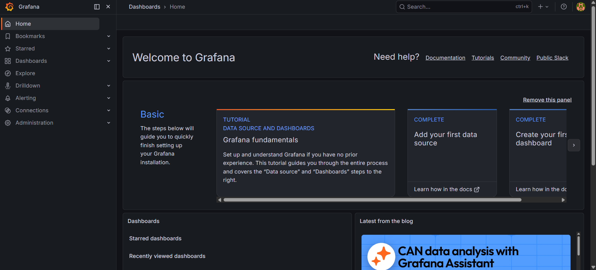

### Grafana — Available Dashboard Templates
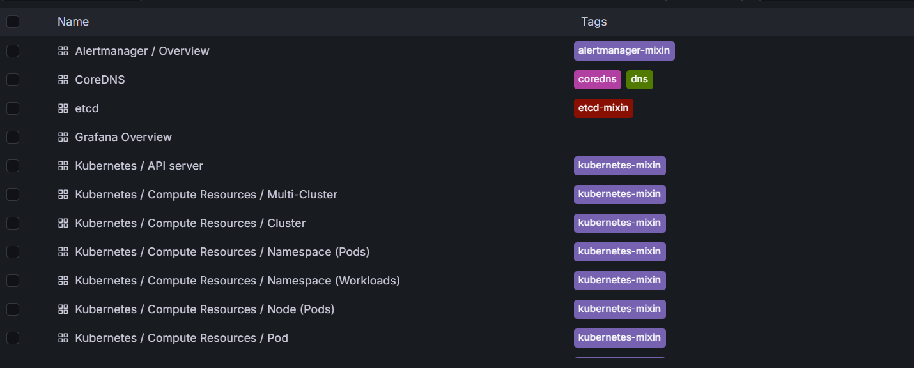


### Grafana — CPU Metrics (gitops-app namespace)
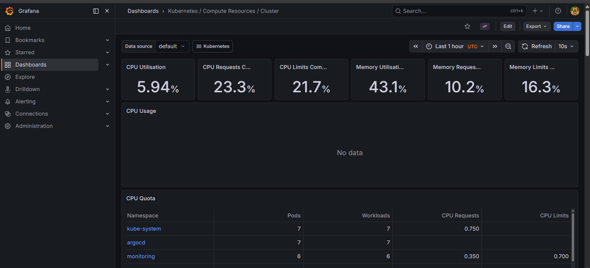

### Grafana — Node Metrics
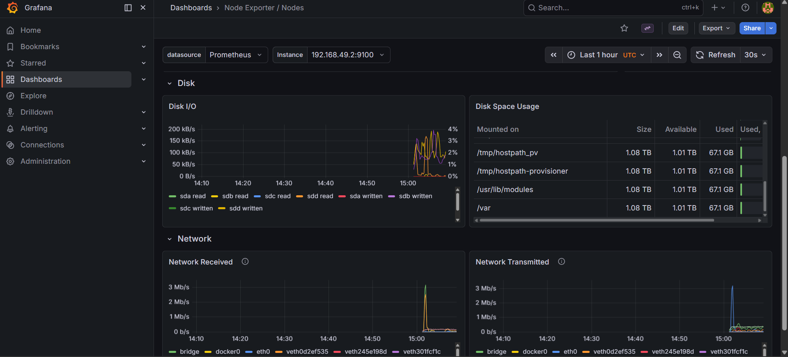

### Grafana — Node Usage
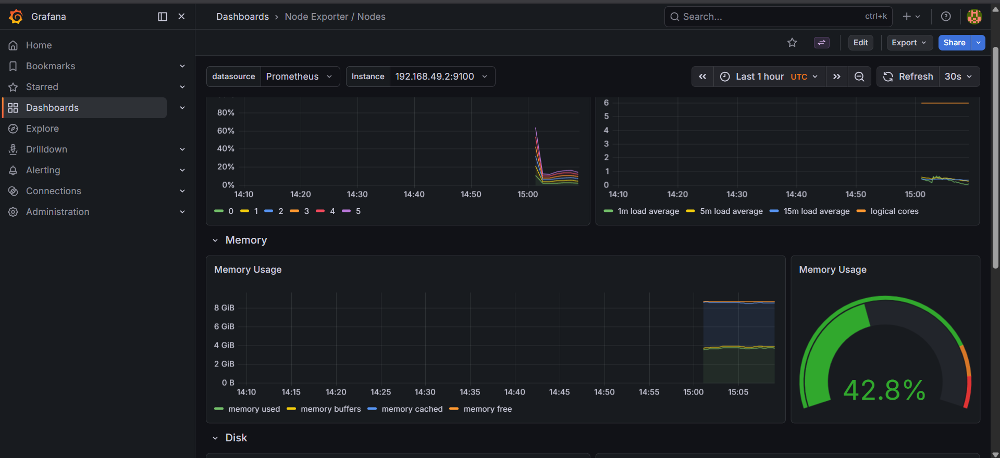

### Prometheus — Alert Rules Registered
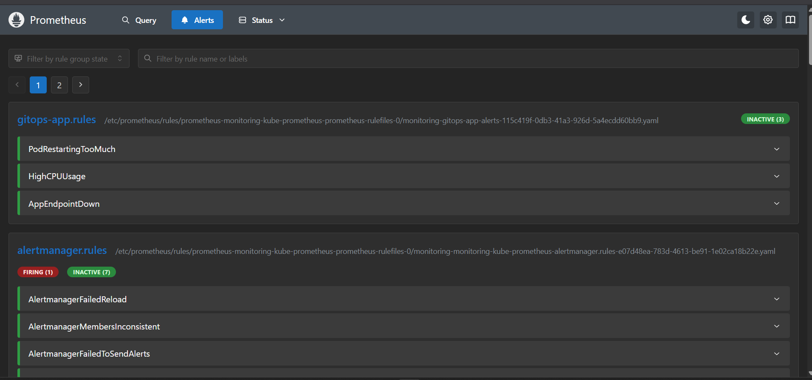

### Prometheus — Alerts Pending
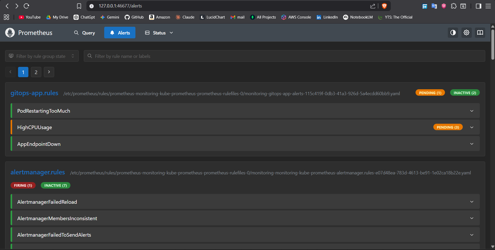

### Prometheus — Alerts Firing
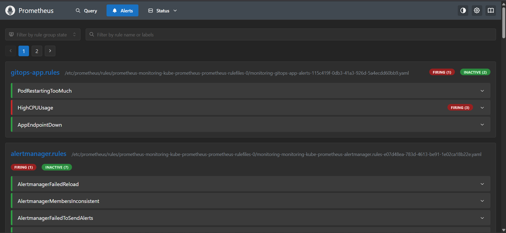

### Stress Test — Load Simulation
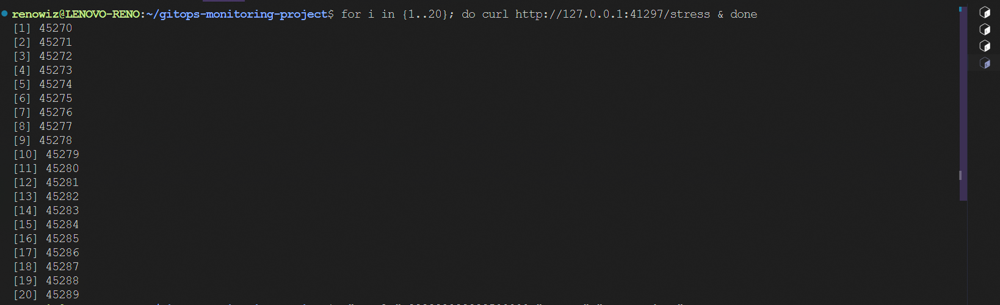

### Terraform — Infrastructure as Code Applied
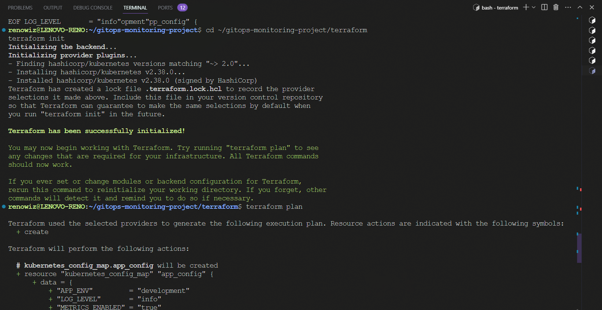

---

## Features

**GitOps Automation**
ArgoCD continuously watches the GitHub repository and automatically reconciles the Kubernetes cluster to match the desired state defined in Git. selfHeal is enabled — any manual cluster changes are automatically reverted to match Git.

**Real-Time Monitoring**
The kube-prometheus-stack provides full-cluster observability. Prometheus scrapes metrics every 15 seconds from all pods. Pre-built Grafana dashboards visualize CPU, memory, network I/O, and pod health across namespaces.

**Custom Application Metrics**
The Flask app exposes a `/metrics` endpoint with custom Prometheus metrics — request count per endpoint and request latency histograms — providing application-level observability on top of infrastructure metrics.

**Intelligent Alerting**
Three custom PrometheusRule alerts are configured:
- `HighCPUUsage` — fires when pod CPU crosses threshold
- `PodRestartingTooMuch` — fires on pod restart events
- `AppEndpointDown` — fires when app pods become unreachable

**Infrastructure as Code**
All namespaces and configuration are managed via Terraform, ensuring the environment is fully reproducible, auditable, and version controlled.

---

## Prerequisites

- Ubuntu (WSL2 or native)
- Docker
- kubectl
- Minikube
- Helm
- Terraform
- Git

---

## Setup and Installation

### 1. Clone the repository
```bash
git clone https://github.com/RenoX23/gitops-monitoring-project.git
cd gitops-monitoring-project
```

### 2. Start Minikube
```bash
minikube start --driver=docker --cpus=4 --memory=5000
```

### 3. Build the app image
```bash
eval $(minikube docker-env)
docker build -t gitops-app:v1 app/
```

### 4. Deploy Kubernetes manifests
```bash
kubectl apply -f k8s/namespace.yaml
kubectl apply -f k8s/deployment.yaml
kubectl apply -f k8s/service.yaml
```

### 5. Install ArgoCD
```bash
kubectl create namespace argocd
kubectl apply -n argocd -f https://raw.githubusercontent.com/argoproj/argo-cd/stable/manifests/install.yaml
kubectl patch svc argocd-server -n argocd -p '{"spec": {"type": "NodePort"}}'
```

### 6. Apply ArgoCD Application
```bash
kubectl apply -f argocd/application.yaml
```

### 7. Install Prometheus + Grafana stack
```bash
helm repo add prometheus-community https://prometheus-community.github.io/helm-charts
helm repo update
helm install monitoring prometheus-community/kube-prometheus-stack \
  --namespace monitoring \
  --values monitoring/prometheus-values.yaml
```

### 8. Apply alert rules
```bash
kubectl apply -f alerting/alertmanager-config.yaml
```

### 9. Apply Terraform
```bash
cd terraform
terraform init
terraform apply -auto-approve
```

---

## Accessing the Services

```bash
# ArgoCD UI
minikube service argocd-server -n argocd --url

# Grafana (admin / gitops123)
minikube service monitoring-grafana -n monitoring --url

# Prometheus
minikube service monitoring-kube-prometheus-prometheus -n monitoring --url

# Application
minikube service gitops-app-service -n gitops-app --url
```

---

## Demo Scenarios

### GitOps Loop Demo
Change the replica count in `k8s/deployment.yaml`, push to GitHub, and watch ArgoCD automatically sync the cluster without any manual kubectl commands.

```bash
# Edit replicas in k8s/deployment.yaml then:
git add . && git commit -m "scale deployment" && git push origin main
# Watch ArgoCD UI auto-sync within 3 minutes
```

### Alert Firing Demo
Simulate a production outage by scaling the app to 0. Watch Prometheus detect it and fire the alert automatically.

```bash
kubectl scale deployment gitops-app -n gitops-app --replicas=0
# Watch Prometheus Alerts page — alert fires within 60 seconds
kubectl scale deployment gitops-app -n gitops-app --replicas=3
# Alert resolves automatically on recovery
```

---

## Key Concepts Demonstrated

- **GitOps** — Git as single source of truth for infrastructure and application state
- **Declarative Infrastructure** — desired state defined in code, not commands
- **Observability** — metrics, dashboards, and alerts as first-class concerns
- **Self-Healing** — ArgoCD reverts manual cluster changes to match Git
- **Infrastructure as Code** — Terraform manages namespaces and configuration
- **SLA Monitoring** — Prometheus rules enforce availability thresholds

---

## Author

**Renold Stephen R**
M.Tech Computer Science — Christ University, Bangalore
[GitHub](https://github.com/RenoX23) | [LinkedIn](https://linkedin.com/in/renoldstephen)
